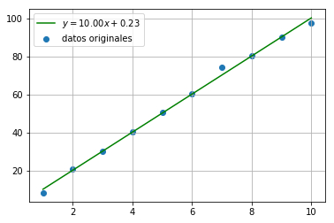

## Ajustes Primer Orden: Regresión Lineal

Este modelo matemático permite una relación aproximada entre una variable escalar dependiente ($y$) y una variable independiente ($x$) de la forma $y = mx + b$, siendo $m$ la pendiente de la recta y $b$ el intercepto. Ésta recta minimiza la suma de cuadrados de la distancia para cada uno de los datos. Es decir, dados $n$ pares de datos $(x_{i} , y_{i})$, los paramétros $m$ y $b$ que minimizan el error están dados por,

$\abs{(m x_{i} + b)- y_{i}}^{2}$

Por lo tanto, definiendo un vector paramétro como $\textbf{w} = (m, b)^{T}$ como la solución de mínimos cuadrados del siguiente sistema,

$ \begin{bmatrix}
	x_{1}  & 1\\
	x_{2}  & 1\\
	\vdots & 1 \\
	x_{n} & 1
	\end{bmatrix} \textbf{w} = (y_{1}, y_{2}, ..., y_{n})^T$

Existen variedad de formas para implementar un ajuste lineal en Python utilizando librerías como `numpy`, `scipy`, `stats model` y `sckit learn`. En particular, se hará uso de la librería `scipy` y el modulo `stats` como se muestra a continuación.

```python
import matplotlib.pyplot as plt
import numpy as np
from scipy.stats import linregress

x = np.arange(1, 11, 1)
y = 10.0 * x
y += np.random.normal(0, 2, size=y.shape)

m, b, r, *otros = linregress(x, y)

y_ajustado = m * x + b

plt.figure()
plt.scatter(x, y, label='Datos originales')
plt.plot(x, y_ajustado, c='green', label='$y={m: .2f}x {b: +.2f}$'.format(m=m, b=b))
plt.legend()
plt.grid()
plt.show()
```



## Ajustes De Curvas

Una de las tareas más importantes en cualquier ciencia experimental es el modelamiento de datos en donde el objetivo es encontrar una función que describa el comportamiento de los datos experimentales. En esta sección, se explicará el ajuste de funciones arbitrarias, es decir exponenciales, polinomiales y demás funciones no lineales haciendo uso de Python.

2.1. Regresión Lineal Para Funciones No Lineales

Es posible ajustar funciones no lineales en parámetros de ajuste, siempre y cuando sea posible transformar la función de ajuste en una que sea lineal en los parámetros de ajuste y en la variable independiente.

*Ejemplo: Regresión Lineal Para Función Exponencial*

Supongamos que se tomaron datos de una fuente radioactiva que estaba emitiendo partículas $\beta$ (electrones) y se notó que el número de electrones por unidad de tiempo decrece. Teóricamente, el número de electrones $N$ emitidos por unidad de tiempo deberían decaer exponencialmente,

$N(t) = N_{0} \exp{-t/ \tao}$


Existe una transformación que permite llevarla a una forma lineal. Para ello,

$\ln{N} = ln{N_{0}} - \frac{t}{\tao}$

Con esta transformación, la función que se desea ajustar es lineal en la variable independiente $t$. Dado que $N_{0}$ y $\tao$ son parámetros no lineales, se definen los nuevos parámetros de ajuste como,

$a = \ln{N_{0}}$
$b = - \frac{1}{\tao}$

Ahora, definiendo una nueva variable dependiente como $y=\ln{N}$, la nueva función de ajuste lineal en los parámetros $a$ y $b$ es,

$y = a + bt$

Por último, para un análisis riguroso, es necesario transformar las incertidumbres $\delta N$ en $N$ en las nuevas $\delta y$ en $y$.

$y = \ln{N}$
$\delta y = \abs{\frac{\delta y}{\delta N}\delta N}$
$\delta y = \frac{\delta N}{N}$

El siguiente código ilustra como realizar este procedimiento en Python.


$\tiny Este ejemplo fue tomado de \textbf{\textit{Introduction to Python for Science}}, \textit{David J. Pine}$

*Ejemplo: Regresión Lineal Para Función Potencia*

Para ajustar datos a una función potencia de la forma,

$P = P_{0}s^{\alpha}$

Se realiza una transformación similar a la vista anteriormente.

$\ln{P} = \ln{P_{0}} + \alpha \ln{s}$

Donde las nuevas variables son $x = \ln{s}$, $y = \ln{P}$, $a = \ln{P_{0}}$ y $b = \alpha$.

2.2. Ajuste No Lineal

