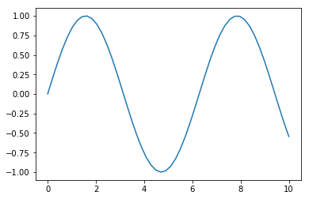

## ¿Qué es Matplotlib?

Es una biblioteca de dibujo de Python 2D la cual genera figuras de alta calidad
para su posterior publicación en gran variedad de formatos y en plataformas
interactivas. Con esta biblioteca se pueden generar gráficas, histogramas,
espectros de potencia, gráficos de barras, gráficos de error, gráficos de
dispersión y más. En la [documentación](http://matplotlib.org/2.0.0/index.html)
de este módulo se puede encontrar más información.

Una buena **técnica** para aprender a realizar gráficos haciendo uso de
Matplotlib es la siguiente:

1. Visitar la [galería](http://matplotlib.org/2.0.0/gallery.html) de Matplotlib.
2. Buscar un gráfico similar al que desea realizar.
3. Ver el código y adaptarlo a conveniencia.

Además de la documentación de éste módulo, adjunto se encuentra el archivo
trabajado en clase.

## Bases

```python
import matplotlib.pyplot as plt
import numpy as np

x = np.linspace(0, 10)
y = np.sin(x)

plt.figure()
plt.plot(x, y)
plt.show()
```

Las primeras dos líneas importan matplotlib y numpy, las siguientes crean
un arreglo equiespaceado de números entre 0 y 10, y otro con el seno de cada
uno de los elementos, luego se crea una nueva figura, se grafican los valores
de $x$ y $y$ y por último se muestra en pantalla.



```python
import matplotlib.pyplot as plt
import numpy as np

x = np.linspace(0.1, 10)
y = x ** 2

plt.figure()
plt.plot(x, y, label='data')
plt.plot(x, np.log(y), label='log')
plt.xlabel('Distancia [m]')
plt.ylabel('Tiempo [s]')
plt.legend(loc='best')
plt.grid()
plt.show()
```

La propiedad `label` agrega una etiqueta al correspondiente plot y, posteriormente, es mostrado por `legend`; ubicando las etiquetas en la mejor posición dentro de la gráfica.
`xlabel` al igual que `ylabel` etiquetan el eje x y el eje y, respectivamente.
Tanto `label` como `xlabel`, `ylabel` reciben strings o cualquier cosa que pueda ser convertida con `%`.


```python
import numpy as np
import matplotlib.pyplot as plt

theta = np.linspace(0, 3 * np.pi, 100000)
r = np.sin(theta ** 2)

plt.figure()
plt.polar(theta, r)
plt.show()
```

Como su nombre lo indica, `polar` realiza una gráfica en coordenadas polares,
tomando como argumentos el ángulo $\theta$ y la distancia $r$.


```python
# Se asume que las librerías correspondientes ya están importadas
plt.figure()
plt.boxplot([
    np.random.normal(i, 0.5, size=(100, ))
    for i in range(0, 10)
])
plt.title('Mi primer box plot')
plt.xlabel('x [ua]')
plt.ylabel('y [ua]')
plt.grid()
plt.show()
```

La segunda línea, `boxplot`, realiza una gráfica conocida en estadística como
'diagrama de cajas y bigotes' (box and whisker) para cada valor de x. La caja
se extiende del cuartil inferior al superior, donde la línea indica la mediana
de estos valores. Los bigotes se extienden desde la caja mostrando el rango de
los datos. Para este caso, se tiene para x una lista con números aleatorios de
una distribución gaussiana con una desviación stándard de $0.5$.


```python

plt.figure()
for i in range(2, 6):
    x = np.arange(-10, 10)
    y = x ** i
    plt.plot(x, y, label=r'$y = x ^ {{{exp}}}$'.format(exp=i))
plt.legend()
plt.grid()
plt.show()
```

La primera línea crea una figura, la segunda evalúa $y$ para valores de $i$ de
$2$ a $6$ (sin tomar el valor $6$) y después se grafican. La letra _r_ indica
que se hará uso de LaTeX; `.format` convierte los valores de $i$ a string.


```python

plt.figure()
for i in range(2, 6):
    x = np.arange(0, 10)
    y = x ** (i / 2)
    plt.loglog(x, y, label=r'$y = x ^ {{{exp}}}$'.format(exp=i/2))
plt.legend()
plt.grid()
plt.show()
```

Al igual que en el código anterior, las primeras $4$ líneas cumplen la misma función. La quinta línea toma el logaritmo en base Euler (por defecto) de $y$ y $x$.


```python

x = np.arange(-10, 10)
y = x ** 3
theta = np.linspace(-np.pi, np.pi)
r = np.sin(theta)
rands = np.random.chisquare(10, size=(10000, ))

plt.figure()
plt.subplot(221)
plt.plot(theta, r)
plt.xlabel(r'$\theta$')
plt.ylabel(r'$r$')
plt.subplot(223)
plt.hist(rands, normed=True)
plt.xlabel(r'$x$')
plt.ylabel(r'$p(x)$')
plt.subplot(122)
plt.loglog(x, y)
plt.xlabel(r'$\log(x)$')
plt.ylabel(r'$\log(x^3)$')
plt.tight_layout()
plt.show()
```

Subplot se encarga de crear múltiples gráficas en una figura, sus argumentos corresponden al número de filas, número de columnas y por último, el número de la figura al que corresponderá los subplots.
La penúltima línea agrega un espacio entre los subplots.


