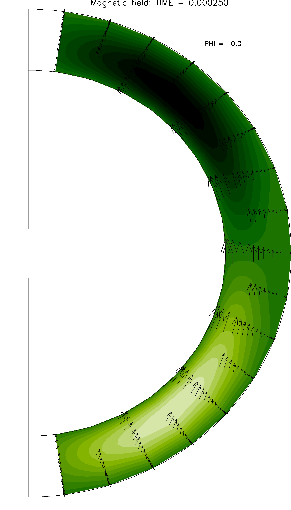

The effects of the non-linear Hall drift on the evolution of the magnetic field in neutron stars have been subject of research during last decades. Several authors have made theoretical research progress in this direction and have found analytical configurations which are solutions of the linear term of the induction equation (Ohmic modes). However, a general stability study of these solutions is still required. As a result of this idea, We study the stability of these configurations against arbitrary non-axisymetric (3D) perturbations.  The final purpose to check the stability or instability of these Ohmic modes, We study the transfer of energy between the poloidal and toroidal multipoles, caused by their non-linear coupling through the Hall effect.

    
    

