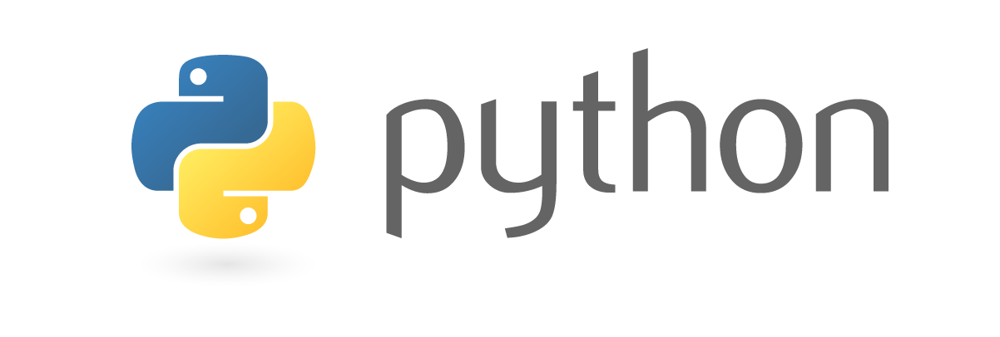
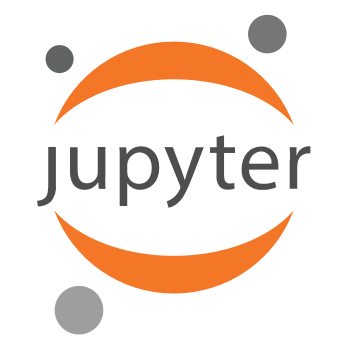
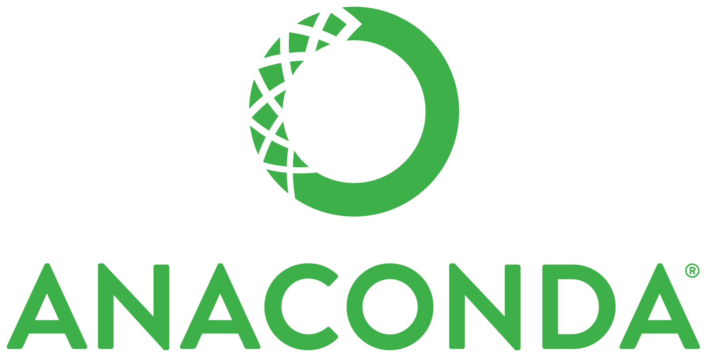

This is a mini-course dictated by the Mathematician **Miguel González Duque**, who belonged to PCM in last years. The course is orientated to [Python3](https://www.python.org/download/releases/3.0/). All the notes were done in [jupyter notebook](http://jupyter.org/) using the python3 distribution of [Anaconda](https://www.continuum.io/anaconda-overview).

The notes of the course can be downloaded from [here](Cursillo_de_python.pdf).

If you have some question or suggestion, you can write to Miguel to his email: [migonzalezdu@unal.edu.co](mailto:migonzalezdu@unal.edu.co).

    <a href="https://www.python.org/download/releases/3.0/" target="_blank">
        </img>
    </a>
    <a href="http://jupyter.org/" target="_blank">
        </img>
    </a>
    <a href="https://www.continuum.io/anaconda-overview" target="_blank">
        </img>
    </a>

