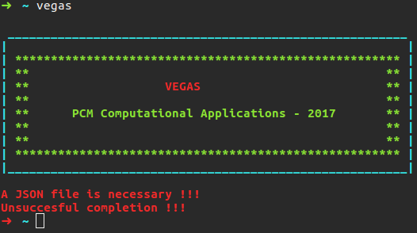

Until date, it is so easy to install 𝕍egas in Ubuntu 14.* and 16.*. In the future. the installation will be so easy. We are working in this.

In order to install 𝕍egas you need to have installed in your computer the libraries for [HDF5](https://support.hdfgroup.org/HDF5/), [JSON](https://en.wikibooks.org/wiki/JsonCpp) and, ofcourse, g++. Let's talk about HDF5 and JSON. HDF5 is a data model, library, and file format for storing and managing data. Data is saved in binary such that the writing and reading is so fast. We use HDF5 because the simulation history usually is huge. If we would save the data in text, a simulation history could have a size until 30 Gb ... that is a bad idea. For this reason we decided to use HDF5. On the other hand, we used JSON to read the input for the simulation. It is a pretty format for inputs.

To install HDF5, JSON and g++ in your PC, you need to get the libhdf5-dev, libjsoncpp-dev and g++ libraries with the following command

```bash
sudo apt-get install libjsoncpp-dev libhdf5-dev g++
```

Moreover, you need cmake with a version > 3.5.1 to compile the project. By default, Ubuntu 14.* and 16.* have in their repositories a cmake version greater than 3.5.1. To install cmake, run this command

```bash
sudo apt-get install cmake
```

To check the version of cmake, run

```bash
cmake --version
```

In this point you have all the dependencies that you need to install 𝕍egas. Download 𝕍egas from the master branch from [here](https://github.com/jdalzatec/vegas/archive/master.zip), unzip and enter in the respective folder. When you run ```ls```, you should get the following output

```bash
analyzers  code  compilers  Dockerfile  executables  README.md
```

where **analyzers**, **code**, **compilers** and **executables** are folders and ~Readme.md~ and ~Dockerfile~ are files. To build with ```cmake``` in Linux, enter in **compilers/linux/** and create a folder named build, enter in this, run ```cmake ..``` and run ```make```. You can do the before with the following

```bash
mkdir compilers/linux/build && cd compilers/linux/build && cmake .. && make
```

You should get in console some information like

```bash
-- The CXX compiler identification is GNU 5.4.0
-- The C compiler identification is GNU 5.4.0
-- Check for working CXX compiler: /usr/bin/c++
-- Check for working CXX compiler: /usr/bin/c++ -- works
-- Detecting CXX compiler ABI info
-- Detecting CXX compiler ABI info - done
-- Detecting CXX compile features
-- Detecting CXX compile features - done
-- Check for working C compiler: /usr/bin/cc
-- Check for working C compiler: /usr/bin/cc -- works
-- Detecting C compiler ABI info
-- Detecting C compiler ABI info - done
-- Detecting C compile features
-- Detecting C compile features - done
-- Found HDF5: /usr/lib/x86_64-linux-gnu/hdf5/serial/lib/libhdf5.so;/usr/lib/x86_64-linux-gnu/libpthread.so;/usr/lib/x86_64-linux-gnu/libsz.so;/usr/lib/x86_64-linux-gnu/libz.so;/usr/lib/x86_64-linux-gnu/libdl.so;/usr/lib/x86_64-linux-gnu/libm.so (found version "1.8.16") 
-- /usr/include/hdf5/serial
-- Found jsoncpp: /usr/include  
-- /usr/include/jsoncpp/json
-- Configuring done
-- Generating done
-- Build files have been written to: /home/jdalzatec/Desktop/vegas-master/compilers/linux/build
Scanning dependencies of target vegas
[ 16%] Building CXX object CMakeFiles/vegas.dir/home/jdalzatec/Desktop/vegas-master/code/main.cc.o
[ 33%] Building CXX object CMakeFiles/vegas.dir/home/jdalzatec/Desktop/vegas-master/code/src/lattice.cc.o
[ 50%] Building CXX object CMakeFiles/vegas.dir/home/jdalzatec/Desktop/vegas-master/code/src/reporter.cc.o
[ 66%] Building CXX object CMakeFiles/vegas.dir/home/jdalzatec/Desktop/vegas-master/code/src/system.cc.o
[ 83%] Building CXX object CMakeFiles/vegas.dir/home/jdalzatec/Desktop/vegas-master/code/src/atom.cc.o
[100%] Linking CXX executable vegas
[100%] Built target vegas
```

and in your **build** folder some files and a folder were created. Moreover, a executable file named 𝕍egas was created. This is the part of 𝕍egas to run the simulations. You can have this file in all folder where you are going to run a simulation. But it is better have the 𝕍egas executable into your ```/usr/bin/``` folder such that 𝕍egas can be executed wherever. If you want this, run ```sudo make install``` and 𝕍egas will be into ```/usr/bin/```.

If all was fine, when you run in your terminal the command 𝕍egas, a message like this should be showed

<center>
    
</center>

In this point, you need to have a JSON file to run 𝕍egas. Let's go to learn how to make this file in the next section. But firts, let me to show you how you should to [build the sample](/vegas/system-building/).


---

* [Home](/vegas/)
* [Model and method](/vegas/model-and-method/)
* [System building](/vegas/system-building/)
* [Simulation and data analysis](/vegas/simulation-and-data-analysis/)
* [Tutorials](/vegas/examples/)