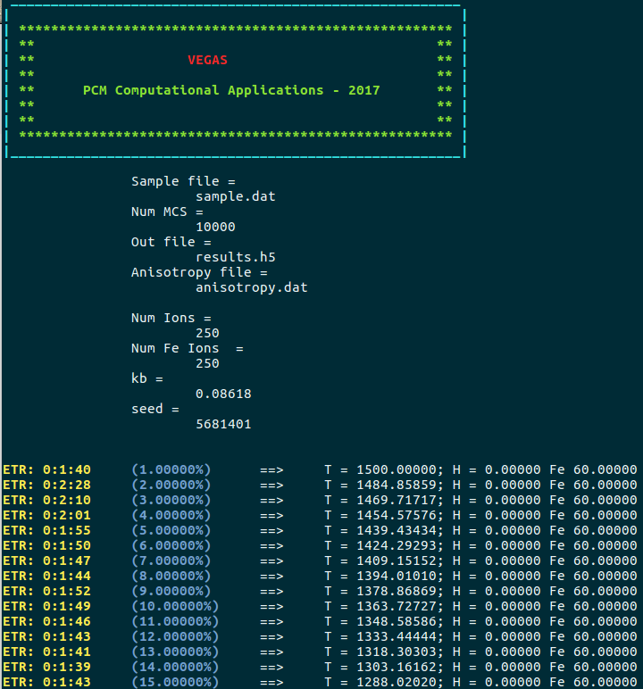

In this section, the general features of the simulation and data analysis processes are presented. Further explanation applied to different examples can be found in the [Tutorials](/vegas/examples/) section.

## Simulation

### Input files

𝕍egas takes in some input files to perform a simulation:

* Configuration file
* Sample file
* Anisotropy file (optional)
* Initial state file (optional)

#### Configuration file

In this file, the simulation parameters are defined using a [JSON](https://www.w3schools.com/js/js_json_intro.asp) file format. The following attributes can be defined in this file:

* sample (string - required): Path to the sample file.
* anisotropy (string or list of strings - optional - default: None): Path to the anisotropy file(s).
* initialstate (string - optional - default: None): Path to the sample initial state file.
* out (string - optional - default: sample_file_path.h5): Path to the results output file in hdf5 format.
* mcs (integer - optional - default: 5000): Number of Monte Carlo steps per temperature/magnetic field pair step.
* seed (integer - optional - default: current time): Random number seed.
* kb (float - optional - default: 1.0): Boltzmann constant value.
* field (float, list of floats or struct - optional - default: 0.0): External magnetic field values.
* temperature (float, list of floats or struct - optional - default: 0.0): Temperature values.

An example of a configuration file is shown below:

```json
{
    "sample": "sample.dat",
    "anisotropy": "anisotropy.dat",
    "initialstate": "initialstate.dat",
    "out": "results.h5",
    "mcs": 10000,
    "seed": 5681401,
    "kb": 0.08618,
    "field": 0.0,
    "temperature": 100.0
}
```

In this example, the system is simulated at a temperature of $100\ arb. units$ without presence of external magnetic field. There are different ways to input the values of the "field" and "temperature" attributes: 

If the "field" is a float and the "temperature" a list, the system is simulated using the same inputed "field" float at each "temperature" value, and vice versa:

```json
    "field": 0.5,
    "temperature": [10.0, 20.0, 30.0, 40.0, 50.0]
```

If both attribute values are inputed as lists, the number of items in each list must be the same.

```json
    "field": [0.5, 1.0, 1.5, 2.0, 2.5],
    "temperature": [10.0, 20.0, 30.0, 40.0, 50.0]
```

Then, each temperature is simulated using its corresponding value in the "field" lists, i.e., the simulation is carried out at (temperature, magnetic field) pair steps of ($10.0, 0.5$), ($20.0, 1.0$), ($30.0, 1.5$), ($40.0, 2.0$) and ($50.0, 2.5$).

Structures can also be used to input the values:

```json
    "field": 1.0,
    "temperature": {
        "start": 1500.0,
        "final": 1.0,
        "points": 100
    }
```

Using this structure, the system is cooled down from $1500.0$ to $1.0\ arb. units$ in a constant magnetic field of $1.0\ arb. unit$ using $100$ temperature steps.

Also, the values can be *cycled* ("cycle"), which is useful for hysteresis loop simulations:

```json
    "field": {
        "start": 2.0,
        "final": -2.0,
        "points": 100,
        "cycle": true
    },
    "temperature": 10.0
```

Using this structure, the magnetic field is varied from $2.0$ to $-2.0\ arb. units$, and then from $-2.0$ to $2.0\ arb. units$ at a temperature of $10\ arb. units$ for a total of $200-1=199$ steps ($-2.0$ is discarded once to avoid a repetition).

#### Sample, anisotropy and initial state files

The sample and anisotropy files contain the structural and magnetic characteristics of the system that will be simulated. The user can input different anisotropy files, each one adding an anisotropy term to the Hamiltonian. The initial state file contains a system magnetization state that will be used to start the simulation. However, this file is optional, and if no file is given, the system would start in a random magnetization state. The name of these files must match the filenames in the path of the "sample", "anisotropy" and "initialstate" attributes in the configuration file. The format and construction of these files is explained in the [System building](/vegas/system-building/) section.

### Starting the simulation

Once all the files have been created, to start the simulation, open a terminal and change directory to the folder. If the name of the configuration file is config.json, execute:

``` shell
vegas config.json
```

Then, a message like this should appear:



In this message, it is possible to appreciate the input and output files, along with the value of kb, the random seed number and the number of sites per type (all Fe ions in this simulation). Also, some information is shown per temperature/magnetic field pair. The ETR (Estimated time remaining) of the simulation, which is an estimation of the time remaining to complete the simulation, is shown in the first column. Then, the percentage of completion of the simulation and the temperature/magnetic field pair that is being simulated are shown. Finally, because the Adaptive move is being used as the spin update policy, the cone width is shown. In simulations where various types are considered, the cone width for each type should appear.

Once the simulation is completed a message like this should appear: 


Finally, an output file (results.h5) must has been created. This file contains all the history of the simulation, from where the magnetic properties of the system can be extracted and analyzed.  

# Data analysis

Simulation results are stored in a set of variables and attributes. Variables include the temperature, external magnetic field and energy values, ions spatial positions, final magnetization states, spatial components of the magnetization per ion type and spatial components of the total magnetization. The final magnetization states correspond to the magnetization state of the system at the last Monte Carlo step per temperature/magnetic field pair point. Attributes include the number of Monte Carlo steps, random number seed and Boltzmann constant value.

[HDFView](https://support.hdfgroup.org/products/java/hdfview/) is an useful tool to visualize the contents of the output file. If the output file is opened with this tool, something like this is observed:


However, to handle the data and facilitate its analysis, it is better to create and use python scripts to extract and visualize the data of interest of the results output file. 

* [Home](/vegas/)
* [Model and method](/vegas/model-and-method/)
* [Installation](/vegas/installation/)
* [System building](/vegas/system-building/)
* [Tutorials](/vegas/tutorials/)
