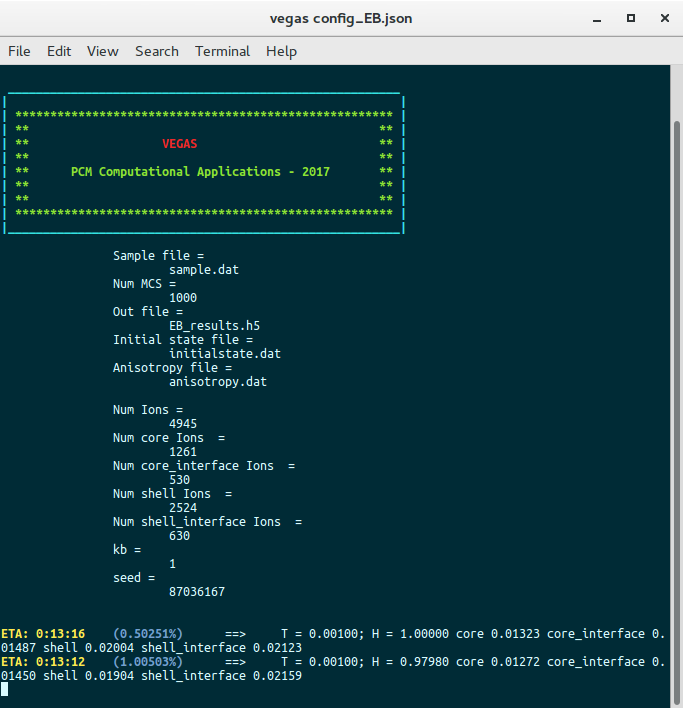
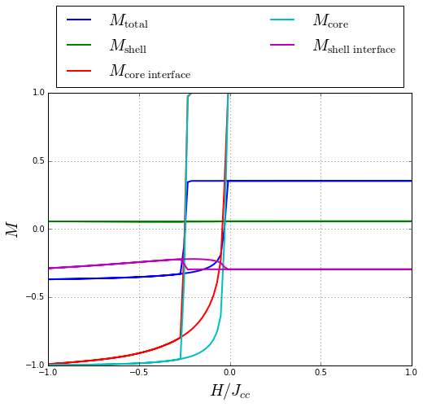
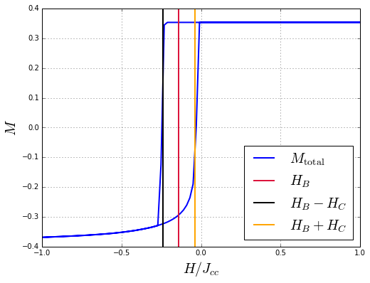

In this tutorial, we explain how to simulate hysteretic properties of a core/shell nanoparticle.

The system in consideration is a FM/AFM core/shell nanoparticle. Nearest neighbors exchange interactions, uniaxial anisotropy and external magnetic field were considered. To describe the magnetic behavior of the core and the shell, the following parameters were used (see [Dimitriadis et al.](https://journals.aps.org/prb/abstract/10.1103/PhysRevB.92.064420)):

$$J_{FM} = J_{cc} = 1.0$$
$$J_{AF} = J_{ss} = -0.5$$
$$J_{int} = -0.5$$
$$k_{FM} = k_c = 0.1$$
$$k_{AF} = k_s = 0.5$$
$$|\mathbf{S}_c| = |\mathbf{S}_s| = 1.0$$
$$R = 10.5$$
$$R_c = 7.5$$
<center>Spin update policy: Adaptive move</center>

<br/>

where $J_{FM}$, $J_{AF}$ and $J_{int}$ are the nearest neighbors exchange interaction constants corresponding to core-core, shell-shell and core-shell interactions, respectively, $k_{FM}$ and $k_{AF}$ are the anisotropy constants of the core and the shell, respectively, $|\mathbf{S}_c|$ and $|\mathbf{S}_s|$ are the core and shell spin moments, respectively, and $R_c$ and $R$ are the core and total radius of the nanoparticle, respectively.

The simulation is carried out in two stages:
Firstly, in order to produce exchange bias, the nanoparticle must be cooled down from a temperature between the Néel temperature of the antiferromagnetic shell ($T_N$) and the Curie temperature of the ferromagnetic core ($T_C$), in presence of an external magnetic field ($H_{max}$), to a very low temperature $T_{sim}$. However, this cooling process can be avoided because the magnetization state of the nanoparticle at the end of the cooling process can be known *a priori*. Therefore, this stage is avoided by inputing an initial state for the magnetization of the nanoparticle to the simulation, in which the ferromagnetic core ions are oriented along the $+z$ direction and the antiferromagnetic shell ions alternating between up-down-up-down directions  (see [Evans et al.](https://journals.aps.org/prb/abstract/10.1103/PhysRevB.84.092404) and the [sample building tutorial of this system](/vegas/tutorials/system-building/building-a-core-shell-nanoparticle/).
Secondly, an hysteresis loop is simulated by varying the external magnetic field from $H_{max}$ to $-H_{max}$ and again to $H_{max}$. 
Finally, plots of the hysteresis loops are produced, and the exchange bias and coercive field are computed.

## Simulation

As explained in the [simulation section](/vegas/simulation-and-data-analysis/), four input files with established formats are used to perform a simulation:
* Configuration file (<a class="Link" href="config.json" target="_blank">config.json</a>): Units are coherent with the units used in the [sample building](/vegas/tutorials/system-building/building-a-core-shell-nanoparticle/). Then, ```temperature``` is measured in units of $k_B/J_{FM}$ and ```field``` in units of $\mu_i/J_{FM}$, for $i=FM$, $AF$. The content of the configuration file is shown below:

```json
{
    "sample": "sample.dat",
    "anisotropy": "anisotropy.dat",
    "initialstate": "initialstate.dat",
    "out": "results.h5",
    "kb": 1.0,
    "mcs": 1000,
    "seed": 87036167,
    "field":
    {
        "start": 1.0,
        "final": -1.0,
        "points": 100,
        "cycle": true
    },
    "temperature": 0.001
}
```


* Sample file (<a class="Link" href="sample.dat" target="_blank">sample.dat</a>): This file corresponds to FM/AFM core/shell nanoparticle with simple cubic structure and a core and shell radius of $7.5$ and $3$ magnetic unit cells (muc), respectively. The name of this file must match the filename in the path of the ```sample``` attribute in the configuration file. The construction of this file can be found in the [Building a core/shell nanoparticle](/vegas/tutorials/system-building/building-a-core-shell-nanoparticle/) tutorial.
* Anisotropy file (<a class="Link" href="anisotropy.dat" target="_blank">anisotropy.dat</a>): Uniaxial anisotropy in both the core and shell is considered.  The name of this file must match the filename in the path of the ```anisotropy``` attribute in the configuration file. The construction of this file can be found in the [Building a core/shell nanoparticle](/vegas/tutorials/system-building/building-a-core-shell-nanoparticle/) tutorial.
* Initial state file (<a class="Link" href="initialstate.dat" target="_blank">initialstate.dat</a>): The nanoparticle is initialized in a magnetization state where the ferromagnetic core ions are oriented along the $+z$ direction and the antiferromagnetic shell ions alternating between up-down-up-down directions (see the [sample building tutorial of this system](/vegas/tutorials/system-building/building-a-core-shell-nanoparticle/)).

With all the files placed in the same folder, open a terminal, change directory to the folder and type ```ls```. The next list should appear: 

``` shell
anisotropy.dat  config.json  initialstate.dat  sample.dat
```

Then, we can start the simulation by executing:

``` shell
vegas config.json
```

A message like this should appear:



Once the simulation is completed, a results output file (```results.h5```) is generated. This file contains all the history of the simulation, from where the magnetic properties of the system can be extracted and analyzed.

## Data analysis

Import the required libraries:
* [numpy](http://www.numpy.org/) handles numeric arrays and mathematical operations.
* [h5py](https://www.h5py.org/) provides both a high- and low-level interface to the HDF5 library.
* [matplotlib](https://matplotlib.org/) produces figures.
* [Counter](https://docs.python.org/2/library/collections.html) dict subclass for counting hashable objects.


```python
import numpy
import h5py
from matplotlib import pyplot
from collections import Counter
```

Load the output file into a structure called ```dataset```.


```python
dataset = h5py.File("results.h5", mode="r")
```

If we cast the structure ```dataset```, the set of variables in the output file is printed.


```python
print(list(dataset))
```

    ['core_interface_x', 'core_interface_y', 'core_interface_z', 'core_x', 'core_y', 'core_z', 'energy', 'field', 'finalstates', 'magnetization_x', 'magnetization_y', 'magnetization_z', 'positions', 'shell_interface_x', 'shell_interface_y', 'shell_interface_z', 'shell_x', 'shell_y', 'shell_z', 'temperature', 'types']


Retrieve ```mcs``` (number of Monte Carlo steps) using the method ```attrs``` and define ```tau``` as half the number of Monte Carlo steps. ```tau``` will be the number of Monte Carlo steps that will be discarded for relaxation.


```python
mcs = dataset.attrs.get("mcs")
tau = mcs // 2
```

Load the ion types of each site in order to count them to calculate the magnetization by ion type. To calculate the number of ions by type, use the structure ```Counter```.


```python
types = [t.decode() for t in dataset.get("types")]
num_types = Counter(types)
```

Print the  dictionary ```num_types``` to view the number of ions by type.


```python
print(num_types)
```

    Counter({'shell': 2524, 'core': 1261, 'shell_interface': 630, 'core_interface': 530})


Load the array of magnetic fields to the variable ```fields```.


```python
fields = dataset.get("field")[:]
```

Also, load the total magnetization in $z$ to the variable ```mag_z``` and the magnetization in $z$ of each type to the dictionary ```mag_z_by_type```.


```python
mag_z = dataset.get("magnetization_z")[:, tau:]
mag_z_by_type = {t: dataset.get("%s_z" % t)[:, tau:] for t in num_types}
```

Compute averages for the magnetizations every $10$ Monte Carlo steps.


```python
mag_mean = numpy.mean(mag_z[:, ::10], axis=1) / numpy.sum(list(num_types.values()))
mag_mean_by_type = {t:  numpy.mean(
    mag_z_by_type[t][:, ::10], axis=1) / num_types[t] for t in num_types}
```

Plot the mean magnetization per type as a function of the magnetic field and the mean total magnetization.


```python
pyplot.figure(figsize=(8, 6))
pyplot.plot(fields, mag_mean, label=r"$M_{\rm total}$", lw=2)
for t, mag in mag_mean_by_type.items():
    pyplot.plot(fields, mag, label=r"$M_{\rm %s}$" % t.replace("_", "\ "), lw=2)

pyplot.xlabel(r"$H / J_{cc}$", fontsize=20)
pyplot.ylabel(r"$M$", fontsize=20)
pyplot.xlim(min(fields), max(fields))
pyplot.grid()
pyplot.legend(loc=9, fontsize=20,
              bbox_to_anchor=(0.0, 0.35, 1, 1), ncol=2, mode="expand")
pyplot.show()
```





Compute the intercepts with the magnetic field axis by calculating the midpoint between the magnetic fields where the magnetization sign changes. These intercepts are not centered in $H=0$, indicating the occurrence of exchange bias.


```python
intercepts = list()
for i in range(len(fields) - 1):
    if numpy.sign(mag_mean[i]) != numpy.sign(mag_mean[i + 1]):
        intercepts.append((fields[i] + fields[i + 1]) * 0.5)
print(intercepts)
```

    [-0.2424242424242431, -0.040404040404040949]


Compute the exchange bias field ```Hb``` and the coercive field ```Hc```.


```python
Hb = (intercepts[0] + intercepts[1]) * 0.5
Hc = numpy.abs(intercepts[0] - intercepts[1]) * 0.5
print(Hc, Hb)
```

    0.10101010101 -0.141414141414


Finally, plot the hysteresis loops for the total magnetization indicating the values ```Hb```, ```Hb + Hc``` and ```Hb - Hc```.


```python
pyplot.figure(figsize=(8, 6))
pyplot.plot(fields, mag_mean, label=r"$M_{\rm total}$", lw=2)
pyplot.axvline(Hb, color="crimson", lw=2, label=r"$H_{B}$")
pyplot.axvline(Hb - Hc, color="black", lw=2, label=r"$H_{B} - H_{C}$")
pyplot.axvline(Hb + Hc, color="orange", lw=2, label=r"$H_{B} + H_{C}$")
pyplot.xlabel(r"$H / J_{cc}$", fontsize=20)
pyplot.ylabel(r"$M$", fontsize=20)
pyplot.xlim(min(fields), max(fields))
pyplot.grid()
pyplot.legend(loc=4, fontsize=20)
pyplot.show()
```




---

* [Home](/vegas/)
* [Model and method](/vegas/model-and-method/)
* [Installation](/vegas/installation/)
* [System building](/vegas/system-building/)
* [Simulation and data analysis](/vegas/simulation-and-data-analysis/)
* [Tutorials](/vegas/tutorials/)

