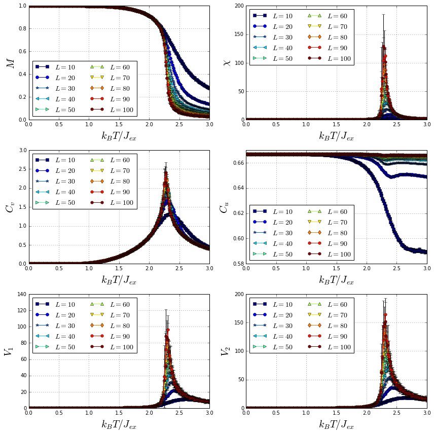

In this tutorial, we explain how to simulate the scaling behavior of a 2D Ising film.

The system in consideration is a ferromagnetic 2D Ising film with an edge length of $10$ magnetic unit cells ($muc$). Only nearest neighbors exchange interaction was considered. The following parameters were used:

$$J = 1.0$$
$$k = 0.0$$
$$|\mathbf{S}| = 1.0$$
$$L = 10$$
<center>Spin update policy: flip</center>

<br/>

where $J$, $k$, $|\mathbf{S}|$ and $L$ are the nearest neighbors exchange interaction constant, anisotropy constant, spin moment and edge length of the 2D Ising system, respectively.

Several 2D Ising films, with edge lengths varying from $10$ to $100$, were cooled down from a high to a low temperature measuring different thermodynamic quantities. The computed thermodynamic quantities include the magnetization $\left(M\right)$, magnetic susceptibility $\left(\chi\right)$, specific heat $\left(C_v\right)$, first order cumulant of the energy $\left(C_u\right)$ and first and second order cumulants of the order parameter. ($V_1$ y $V_2$). Using these quantities is possible to compute the critical exponents of a magnetic system. For more information about thermodynamic quantities and critical exponents, go to [X.T. Pham Phu et al.](https://www.sciencedirect.com/science/article/pii/S0039602808007620) Finally, plots of the thermodynamic quantities for the different system sizes are produced.

## Simulation

As explained in the [simulation section](/vegas/simulation-and-data-analysis/), four input files with established formats are used to perform a simulation:
* Configuration files: In order to compute mean values of the thermodynamic quantities, $10$ configurations files per sample will be created using python.
* Sample files (<a class="Link" href="samples.zip" target="_blank">samples.zip</a>): $10$ sample files of 2D Ising films with edge lengths varying from $10$ to $100$ muc are considered. The construction of these sample files was made using the scrip developed in the [Building a 2D Ising film](/vegas/tutorials/system-building/building-a-2d-ising-film/) tutorial.
* Anisotropy and initial state files: In this simulation, neither anisotropy nor magnetization initial state were considered.

Let's write a python script to generate the configuration files for each sample file.

Import the required libraries

* [glob](https://docs.python.org/3.6/library/glob.html) finds all the pathnames matching a specified pattern according to the rules used by the Unix shell.
* [json](https://docs.python.org/2/library/json.html) is used to dump a dictionary into a JSON file.
* [numpy](http://www.numpy.org/) handles numeric arrays and mathematical operations.


```python
import glob
import json
import numpy
```

Save the sample files in a list named ```samples``` and print this list.


```python
samples = sorted(glob.glob("*.dat"))
print(samples)
```

    ['sample_L_10.dat', 'sample_L_100.dat', 'sample_L_20.dat', 'sample_L_30.dat', 'sample_L_40.dat', 'sample_L_50.dat', 'sample_L_60.dat', 'sample_L_70.dat', 'sample_L_80.dat', 'sample_L_90.dat']


Create a dictionary with the general simulation parameters. The other simulation parameters will be inputed later.


```python
base_config = {
    "kb": 1.0,
    "mcs": 50000,
    "field": 0.0,
    "temperature": {
        "start": 3.0,
        "final": 0.01,
        "points": 200
    }
}
```

Use a ```for``` loop to create $10$ configuration files for each sample file with different random number seed. Then, $100$ configuration files are created.


```python
for i in range(10):
    for sample in samples:
        sample_dict = base_config.copy()
        sample_dict["sample"] = sample
        sample_dict["out"] = sample.replace(".dat", "_%i_.h5" % i)
        sample_dict["seed"] = numpy.random.randint(10000, 10000000)
        
        with open(sample.replace(".dat", "_%i_.json" % i), mode="w") as json_file:
            json.dump(sample_dict, json_file)
```


```python
json_files = sorted(glob.glob("*.json"))
```


```python
print(json_files)
```

    ['sample_L_100_0_.json', 'sample_L_100_1_.json', 'sample_L_100_2_.json', 'sample_L_100_3_.json', 'sample_L_100_4_.json', 'sample_L_100_5_.json', 'sample_L_100_6_.json', 'sample_L_100_7_.json', 'sample_L_100_8_.json', 'sample_L_100_9_.json', 'sample_L_10_0_.json', 'sample_L_10_1_.json', 'sample_L_10_2_.json', 'sample_L_10_3_.json', 'sample_L_10_4_.json', 'sample_L_10_5_.json', 'sample_L_10_6_.json', 'sample_L_10_7_.json', 'sample_L_10_8_.json', 'sample_L_10_9_.json', 'sample_L_20_0_.json', 'sample_L_20_1_.json', 'sample_L_20_2_.json', 'sample_L_20_3_.json', 'sample_L_20_4_.json', 'sample_L_20_5_.json', 'sample_L_20_6_.json', 'sample_L_20_7_.json', 'sample_L_20_8_.json', 'sample_L_20_9_.json', 'sample_L_30_0_.json', 'sample_L_30_1_.json', 'sample_L_30_2_.json', 'sample_L_30_3_.json', 'sample_L_30_4_.json', 'sample_L_30_5_.json', 'sample_L_30_6_.json', 'sample_L_30_7_.json', 'sample_L_30_8_.json', 'sample_L_30_9_.json', 'sample_L_40_0_.json', 'sample_L_40_1_.json', 'sample_L_40_2_.json', 'sample_L_40_3_.json', 'sample_L_40_4_.json', 'sample_L_40_5_.json', 'sample_L_40_6_.json', 'sample_L_40_7_.json', 'sample_L_40_8_.json', 'sample_L_40_9_.json', 'sample_L_50_0_.json', 'sample_L_50_1_.json', 'sample_L_50_2_.json', 'sample_L_50_3_.json', 'sample_L_50_4_.json', 'sample_L_50_5_.json', 'sample_L_50_6_.json', 'sample_L_50_7_.json', 'sample_L_50_8_.json', 'sample_L_50_9_.json', 'sample_L_60_0_.json', 'sample_L_60_1_.json', 'sample_L_60_2_.json', 'sample_L_60_3_.json', 'sample_L_60_4_.json', 'sample_L_60_5_.json', 'sample_L_60_6_.json', 'sample_L_60_7_.json', 'sample_L_60_8_.json', 'sample_L_60_9_.json', 'sample_L_70_0_.json', 'sample_L_70_1_.json', 'sample_L_70_2_.json', 'sample_L_70_3_.json', 'sample_L_70_4_.json', 'sample_L_70_5_.json', 'sample_L_70_6_.json', 'sample_L_70_7_.json', 'sample_L_70_8_.json', 'sample_L_70_9_.json', 'sample_L_80_0_.json', 'sample_L_80_1_.json', 'sample_L_80_2_.json', 'sample_L_80_3_.json', 'sample_L_80_4_.json', 'sample_L_80_5_.json', 'sample_L_80_6_.json', 'sample_L_80_7_.json', 'sample_L_80_8_.json', 'sample_L_80_9_.json', 'sample_L_90_0_.json', 'sample_L_90_1_.json', 'sample_L_90_2_.json', 'sample_L_90_3_.json', 'sample_L_90_4_.json', 'sample_L_90_5_.json', 'sample_L_90_6_.json', 'sample_L_90_7_.json', 'sample_L_90_8_.json', 'sample_L_90_9_.json']


```python
print(len(json_files))
```

    100


Now, each configuration file can be used to run a simulation. However, this long process can be optimized by writing all the possible commands in a file, named ```commands.sh``` in this case, and then executing in parallel each command. This is possible because all the simulations are independent. The possible commands should look like this  

```shell
vegas FILE.json > FILE.log
```
Then, the output is stored in ".log" files that can be monitored independently.


```python
commands_file = open("commands.sh", mode="w")
for json_file in json_files:
    commands_file.write("vegas %s > %s\n" % (json_file, json_file.replace(".json", ".log")))
commands_file.close()
```

To run the $100$ simulations in parallel, we provide a simple python script (click <a class="Link" href="pool.py" target="_blank">here</a> to download), which takes in a commands file and the number of processes to be executed in parallel.  By default, the number of processes is equal to the number of threads of the computer. To run this script is required to install the library "click", which is part of the python packages repository. To install "click", run

```shell
pip install click
```
or using conda

```shell
conda install click
```

Finally, the simulation can be executed in parallel by running

```shell
python pool.py commands.sh
```

Once this process ends, $100$ results output files, with a size close to $5.3$ GB, were generated.

## Data analysis

Import the required libraries:
* [numpy](http://www.numpy.org/) handles numeric arrays and mathematical operations.
* [h5py](https://www.h5py.org/) provides both a high- and low-level interface to the HDF5 library.
* [matplotlib](https://matplotlib.org/) produces figures.
* [glob](https://docs.python.org/3.6/library/glob.html) finds all the pathnames matching a specified pattern according to the rules used by the Unix shell.


```python
import numpy
from matplotlib import pyplot
import h5py
import glob
```

    /usr/local/lib/python3.5/dist-packages/h5py/__init__.py:36: FutureWarning: Conversion of the second argument of issubdtype from `float` to `np.floating` is deprecated. In future, it will be treated as `np.float64 == np.dtype(float).type`.
      from ._conv import register_converters as _register_converters


Create an array of the edge lengths of the systems.


```python
L_arr = range(10, 110, 10)
```

Create a dictionary of output files, where each key is an edge length (```L```) and the value its corresponding output files.


```python
results_by_L = {L: sorted(glob.glob("*_L_%i_*.h5" % L)) for L in L_arr}
```

For instance, let's print ```results_by_L[10]```.


```python
print(results_by_L[10])
```

    ['sample_L_10_0_.h5', 'sample_L_10_1_.h5', 'sample_L_10_2_.h5', 'sample_L_10_3_.h5', 'sample_L_10_4_.h5', 'sample_L_10_5_.h5', 'sample_L_10_6_.h5', 'sample_L_10_7_.h5', 'sample_L_10_8_.h5', 'sample_L_10_9_.h5']


Create a function that takes the ```filename``` and returns the array of temperatures $\left(T\right)$, magnetizations $\left(M\right)$, susceptibilities $\left(\chi\right)$, specific heats $\left(C_v\right)$, firs order cumulants of the energy $\left(C_u\right)$ and first and second order cumulants of the order parameter ($V_1$ y $V_2$). Then, compute the averages discarding half of the Monte Carlo steps for relaxation.


```python
def get_T_M_X_Cv_Cu_V1_V2(filename):
    dataset = h5py.File(filename, mode="r")
    mcs = dataset.attrs["mcs"]
    tau = mcs // 2
    kb = dataset.attrs["kb"]
    num_sites = len(dataset.get("positions"))
    mag_z = numpy.abs(dataset.get("magnetization_z")[:, tau:])
    energy = dataset.get("energy")[:, tau:]
    temperature = dataset.get("temperature")[:]
    
    mag_mean = numpy.mean(mag_z, axis=1) / num_sites
    X = numpy.std(mag_z, axis=1) ** 2 / (kb * temperature * num_sites)
    Cv = numpy.std(energy, axis=1)**2 / (kb * temperature * temperature * num_sites)
    Cu = 1 - numpy.mean(energy**4, axis=1) / (3 * numpy.mean(energy**2, axis=1)**2)
    V1 = numpy.mean(energy, axis=1) - numpy.mean(mag_z * energy, axis=1) / numpy.mean(mag_z, axis=1)
    V2 = numpy.mean(energy, axis=1) - numpy.mean(mag_z**2 * energy, axis=1) / numpy.mean(mag_z**2, axis=1)
    
    dataset.close()
    
    return temperature, mag_mean, X, Cv, Cu, V1, V2
```

Loop over all the edge lengths (```L```) and its corresponding output files, and create dictionaries of the mean values and standard deviations for the computed thermodynamic quantities.


```python
M_mean_dict = dict()
M_std_dict = dict()
X_mean_dict = dict()
X_std_dict = dict()
Cv_mean_dict = dict()
Cv_std_dict = dict()
Cu_mean_dict = dict()
Cu_std_dict = dict()
V1_mean_dict = dict()
V1_std_dict = dict()
V2_mean_dict = dict()
V2_std_dict = dict()

for L in L_arr:
    M_arr = list()
    X_arr = list()
    Cv_arr = list()
    Cu_arr = list()
    V1_arr = list()
    V2_arr = list()
    for filename in results_by_L[L]:
        T, M, X, Cv, Cu, V1, V2 = get_T_M_X_Cv_Cu_V1_V2(filename)
        M_arr.append(M)
        X_arr.append(X)
        Cv_arr.append(Cv)
        Cu_arr.append(Cu)
        V1_arr.append(V1)
        V2_arr.append(V2)
    
    M_mean_dict[L] = numpy.mean(M_arr, axis=0)
    M_std_dict[L] = numpy.std(M_arr, axis=0)
    
    X_mean_dict[L] = numpy.mean(X_arr, axis=0)
    X_std_dict[L] = numpy.std(X_arr, axis=0)
    
    Cv_mean_dict[L] = numpy.mean(Cv_arr, axis=0)
    Cv_std_dict[L] = numpy.std(Cv_arr, axis=0)
    
    Cu_mean_dict[L] = numpy.mean(Cu_arr, axis=0)
    Cu_std_dict[L] = numpy.std(Cu_arr, axis=0)
    
    V1_mean_dict[L] = numpy.mean(V1_arr, axis=0)
    V1_std_dict[L] = numpy.std(V1_arr, axis=0)
    
    V2_mean_dict[L] = numpy.mean(V2_arr, axis=0)
    V2_std_dict[L] = numpy.std(V2_arr, axis=0)
```

Finally, plot all the thermodynamic quantities mean values as function of the temperature for the different system sizes.


```python
markers = "so*<>^vdhh"
cm_subsection = numpy.linspace(0.0, 1.0, len(L_arr))
cmap = pyplot.get_cmap("jet")

fig = pyplot.figure(figsize=(12, 12))

ax1 = fig.add_subplot(321)
for i, L in enumerate(L_arr):
    ax1.plot(T, M_mean_dict[L], "-" + markers[i], label=r"$L = %s$" % L, color=cmap(cm_subsection[i]))
    ax1.errorbar(T, M_mean_dict[L], yerr=M_std_dict[L], fmt="none", ecolor="black")
ax1.grid()
ax1.legend(loc="best", ncol=2, fontsize=14)
ax1.set_xlabel(r"$k_{B}T/J_{ex}$", fontsize=20)
ax1.set_ylabel(r"$M$", fontsize=20)
ax1.set_ylim(0.0, 1.0)


ax2 = fig.add_subplot(322)
for i, L in enumerate(L_arr):
    ax2.plot(T, X_mean_dict[L], "-" + markers[i], label=r"$L = %s$" % L, color=cmap(cm_subsection[i]))
    ax2.errorbar(T, X_mean_dict[L], yerr=X_std_dict[L], fmt="none", ecolor="black")
ax2.grid()
ax2.legend(loc="best", ncol=2, fontsize=14)
ax2.set_xlabel(r"$k_{B}T/J_{ex}$", fontsize=20)
ax2.set_ylabel(r"$\chi$", fontsize=20)
ax2.set_ylim(0.0)


ax3 = fig.add_subplot(323)
for i, L in enumerate(L_arr):
    ax3.plot(T, Cv_mean_dict[L], "-" + markers[i], label=r"$L = %s$" % L, color=cmap(cm_subsection[i]))
    ax3.errorbar(T, Cv_mean_dict[L], yerr=Cv_std_dict[L], fmt="none", ecolor="black")
ax3.grid()
ax3.legend(loc="best", ncol=2, fontsize=14)
ax3.set_xlabel(r"$k_{B}T/J_{ex}$", fontsize=20)
ax3.set_ylabel(r"$C_v$", fontsize=20)
ax3.set_ylim(0.0)


ax4 = fig.add_subplot(324)
for i, L in enumerate(L_arr):
    ax4.plot(T, Cu_mean_dict[L], "-" + markers[i], label=r"$L = %s$" % L, color=cmap(cm_subsection[i]))
    ax4.errorbar(T, Cu_mean_dict[L], yerr=Cu_std_dict[L], fmt="none", ecolor="black")
ax4.grid()
ax4.legend(loc="best", ncol=2, fontsize=14)
ax4.set_xlabel(r"$k_{B}T/J_{ex}$", fontsize=20)
ax4.set_ylabel(r"$C_u$", fontsize=20)


ax5 = fig.add_subplot(325)
for i, L in enumerate(L_arr):
    ax5.plot(T, V1_mean_dict[L], "-" + markers[i], label=r"$L = %s$" % L, color=cmap(cm_subsection[i]))
    ax5.errorbar(T, V1_mean_dict[L], yerr=V1_std_dict[L], fmt="none", ecolor="black")
ax5.grid()
ax5.legend(loc="best", ncol=2, fontsize=14)
ax5.set_xlabel(r"$k_{B}T/J_{ex}$", fontsize=20)
ax5.set_ylabel(r"$V_1$", fontsize=20)
ax5.set_ylim(0.0)


ax6 = fig.add_subplot(326)
for i, L in enumerate(L_arr):
    ax6.plot(T, V2_mean_dict[L], "-" + markers[i], label=r"$L = %s$" % L, color=cmap(cm_subsection[i]))
    ax6.errorbar(T, V2_mean_dict[L], yerr=V2_std_dict[L], fmt="none", ecolor="black")
ax6.grid()
ax6.legend(loc="best", ncol=2, fontsize=14)
ax6.set_xlabel(r"$k_{B}T/J_{ex}$", fontsize=20)
ax6.set_ylabel(r"$V_2$", fontsize=20)
ax6.set_ylim(0.0)

pyplot.tight_layout()
pyplot.show()
```




---

* [Home](/vegas/)
* [Model and method](/vegas/model-and-method/)
* [Installation](/vegas/installation/)
* [System building](/vegas/system-building/)
* [Simulation and data analysis](/vegas/simulation-and-data-analysis/)
* [Tutorials](/vegas/tutorials/)