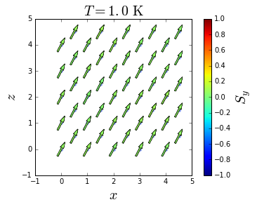

In this tutorial, we explain how to simulate thermal behavior of a bulk system.

The system in consideration is a Fe bulk with BCC structure. Nearest neighbors exchange interactions and cubic anisotropy were considered. To describe the ferromagnetic behavior of Fe, the following parameters were used:

$$J=44.01\ meV/link$$
$$k=3.53e-3\ meV/atom$$
$$|\mathbf{S}|=1.0$$
$$\mu_s=2.22\mu_B$$
<center>Spin update policy: Adaptive move</center>

<br/>

where $J$, $k$, $|\mathbf{S}|$ and $\mu_s$ are the nearest neighbor exchange interaction constant, anisotropy constant, spin moment and atomic magnetic moment, respectively. 

The simulation is carried out cooling down the Fe bulk from a high to a low temperature. Plots of the magnetization, energy, susceptibility and specific heat are extracted from the simulation results. Furthermore, graphics of magnetization states at different temperatures are produced.

## Simulation

As explained in the [simulation section](vegas/simulation-and-data-analysis/), four input files with established formats are used perform a simulation:
* Configuration file (<a class="Link" href="config.json" target="_blank">config.json</a>): These simulation parameters are set to cool down the bulk system from $1500$ to $1$ K without presence of external magnetic field. Units are coherent with the units used in the [system building](/vegas/tutorials/system-building/building-a-bulk-system/). Then, ```kb``` is given in meV/K, ```field``` in T and ```temperature``` in K. The content of the configuration file is shown below:

```json
{
    "sample": "sample.dat",
    "anisotropy": "anisotropy.dat",
    "out": "results.h5",
    "kb": 0.08618,
    "mcs": 10000,
    "seed": 5681401,
    "field": 0.0,
    "temperature": {
        "start": 1500.0,
        "final": 1.0,
        "points": 100
    }
}
```

* Sample file (<a class="Link" href="sample.dat" target="_blank">sample.dat</a>): This file corresponds to a Fe bulk with BCC structure, periodic boundary conditions and an edge length of $10$ muc. The name of this file must match the filename in the path of the ```sample``` attribute in the configuration file. The construction of this file can be found in the [Building a bulk system](/vegas/tutorials/system-building/building-a-bulk-system/) tutorial.
* Anisotropy file (<a class="Link" href="anisotropy.dat" target="_blank">anisotropy.dat</a>): Cubic anisotropy is considered.  The name of this file must match the filename in the path of the "anisotropy" attribute in the configuration file. The construction of this file can be found in the [Building a bulk system](/vegas/tutorials/system-building/building-a-bulk-system/) tutorial.
* Initial state file: In this simulation the system is initialized with a random state; therefore, no initial state file is required.

With all the files placed in the same folder, open a terminal, change directory to the folder and type ```ls```. The next list should appear: 

``` shell
anisotropy.dat  config.json  sample.dat
```


Then, we can start the simulation by executing:

``` shell
vegas config.json
```

A message like this should appear:


Once the simulation is completed, an output file (```results.h5```) with a size of $52$ MB is generated. This file contains all the history of the simulation, from where the magnetic properties of the system can be extracted and analyzed.

## Data analysis

The next python script is created to produce plots of the temperature dependence of the magnetization, susceptibility, specific heat and internal energy of the system, and finally, the time evolution of the magnetic moments.

Import the required libraries:
* [numpy](http://www.numpy.org/) handles numeric arrays and mathematical operations.
* [pyplot](https://matplotlib.org/api/pyplot_api.html) provides a MATLAB-like plotting framework.
* [h5py](https://www.h5py.org/) provides both a high- and low-level interface to the HDF5 library.


```python
import numpy
from matplotlib import pyplot
import h5py
```

Load the output file into a structure called ```dataset```.


```python
dataset = h5py.File("results.h5", mode="r")
print(dataset)
```

    <HDF5 file "results.h5" (mode r)>


If we cast the structure ```dataset```, the set of variables in the output file is printed, as observed with HDFView.


```python
print(list(dataset))
```

    ['Fe_x', 'Fe_y', 'Fe_z', 'energy', 'field', 'finalstates', 'magnetization_x', 'magnetization_y', 'magnetization_z', 'positions', 'temperature', 'types']


The magnetization is stored by type and spatial components. ```Fe_x```, ```Fe_y``` and ```Fe_z``` are the magnetization of sites of type Fe in the x, y and z direction, respectively. In this case, these values are equal to the spatial components of the total magnetization, ```magnetization_x```, ```magnetization_y``` and ```magnetization_z```, because there is just an ion type.

It is possible to retrieve each variable using the method ```get```, which, if printed, shows the dimension (shape) of the variable.


```python
print(dataset.get("Fe_x"))
```

    <HDF5 dataset "Fe_x": shape (100, 10000), type "<f8">


The dimension of ```magnetization``` and ```energy``` are (points, MCS), where points are the number of temperature/magnetic field pairs and MCS is the number of Monte Carlo steps. Therefore, the dimension of ```temperature``` and ```field``` is ($100$, ).


```python
print(dataset.get("temperature"))
print(dataset.get("field"))
```

    <HDF5 dataset "temperature": shape (100,), type "<f8">
    <HDF5 dataset "field": shape (100,), type "<f8">


Handling these variables as numpy arrays facilitates the calculations. Also, using the method ```attrs``` the attributes of the ```dataset``` can be retrieved, which in this case are ```mcs``` (number of Monte Carlo steps), ```seed``` (random number seed) and ```kb``` (Boltzmann constant).


```python
print(dataset.attrs)
print(list(dataset.attrs))
```

    <Attributes of HDF5 object at 139710318743128>
    ['mcs', 'seed', 'kb']


```python
mcs = dataset.attrs["mcs"]
seed = dataset.attrs["seed"]
kb = dataset.attrs["kb"]
print(mcs, seed, kb)
```

    10000 5681401 0.08618


The number of ions can be obtained from the length of the variable ```positions```, which stores the position of every site.


```python
num_sites = len(dataset.get("positions"))
print(num_sites)
```

    250


Load the variables of interest discarding half of the MCS to ensure equilibrium.


```python
tau = mcs // 2
energy = dataset.get("energy")[:, tau:]
mag_x = dataset.get("magnetization_x")[:, tau:]
mag_y = dataset.get("magnetization_y")[:, tau:]
mag_z = dataset.get("magnetization_z")[:, tau:]
```

These variables has a dimension of (100, 5000).


```python
print(energy.shape)
print(mag_x.shape)
print(mag_y.shape)
print(mag_z.shape)
```

    (100, 5000)
    (100, 5000)
    (100, 5000)
    (100, 5000)


Compute the total magnetization.


```python
mag = numpy.linalg.norm(numpy.array([mag_x, mag_y, mag_z]), axis=0)
print(mag.shape)
```

    (100, 5000)


Compute the mean values normalized by the number of sites.


```python
energy_mean = numpy.mean(energy, axis=1) / num_sites
mag_mean = numpy.mean(mag, axis=1) / num_sites
```

Load the variable ```temperature```.


```python
temperature = dataset.get("temperature")[:]
```

Plot the total magnetization and energy as function of temperature.


```python
fig = pyplot.figure(figsize=(16, 6))

ax1 = fig.add_subplot(121)
ax1.plot(temperature, mag_mean, lw=2, color="crimson")
ax1.set_xlabel(r"$T \ \rm [K]$", fontsize=20)
ax1.set_ylabel(r"$M$", fontsize=20)
ax1.grid()

ax2 = fig.add_subplot(122)
ax2.plot(temperature, energy_mean, lw=2, color="royalblue")
ax2.set_xlabel(r"$T \ \rm [K]$", fontsize=20)
ax2.set_ylabel(r"$E$", fontsize=20)
ax2.grid()

pyplot.tight_layout()
pyplot.show()
```


The susceptibility and specific heat can be computed according to:

$$C_v = \dfrac{\left<E^2\right> - \left<E\right>^2}{k_B T^2} = \dfrac{var\left(E\right)}{k_B T^2}$$

and

$$\chi = \dfrac{\left<M^2\right> - \left<M\right>^2}{k_B T} = \dfrac{var\left(M\right)}{k_B T}$$

where $var$ is the variance.


```python
Cv = numpy.std(energy, axis=1)**2 / (kb * temperature**2)
X = numpy.std(mag, axis=1)**2 / (kb * temperature)
```


```python
fig = pyplot.figure(figsize=(16, 6))

ax1 = fig.add_subplot(121)
ax3 = ax1.twinx()
ax1.plot(temperature, mag_mean, lw=2, color="crimson", label=r"$M$")
ax3.plot(temperature, X, lw=2, color="black", label=r"$\chi$")
ax1.set_xlabel(r"$T \ \rm [K]$", fontsize=20)
ax1.set_ylabel(r"$M$", fontsize=20)
ax3.set_ylabel(r"$\chi$", fontsize=20)
ax1.grid()
ax1.legend(loc=3, fontsize=20)
ax3.legend(loc=1, fontsize=20)

ax2 = fig.add_subplot(122)
ax4 = ax2.twinx()
ax2.plot(temperature, energy_mean, lw=2, color="royalblue", label=r"$E$")
ax4.plot(temperature, Cv, lw=2, color="black", label=r"$C_v$")
ax2.set_xlabel(r"$T \ \rm [K]$", fontsize=20)
ax2.set_ylabel(r"$E$", fontsize=20)
ax4.set_ylabel(r"$C_v$", fontsize=20)
ax2.grid()
ax2.legend(loc=2, fontsize=20)
ax4.legend(loc=5, fontsize=20)

pyplot.tight_layout()
pyplot.show()
```


The phase transition is close to $1050$ $K$, which is close to the Curie temperature of Fe ($1043$ K).

Finally, in order to visualize the temperature evolution of the magnetic moments, load the variable ```finalstates```.


```python
finalstates = dataset.get("finalstates")[:]
positions = dataset.get("positions")[:]
print(finalstates.shape)
print(positions.shape)
```

    (100, 250, 3)
    (250, 3)


The dimension of ```finalstates``` is ($100$, $250$, $3$), which corresponds to (points, num_sites, $3$), where points is the number of temperature/magnetic field pairs, num_sites is the number of sites and $3$ is the number of spatial components $x$, $y$ and $z$. In a similar way, ```positions``` has a dimension of ($250$, $3$), which corresponds to (num_sites, $3$).

Visualize the $zy$ projection of the final state at the last value of temperature ($1$ K).


```python
ind = -1
pyplot.figure()
pyplot.scatter(positions[:, 0], positions[:, 2], lw=0, color="royalblue", alpha=0.2)
quivers = pyplot.quiver(positions[:, 0], positions[:, 2],
                        finalstates[ind, :, 0], finalstates[ind, :, 2], finalstates[ind, :, 1],
                        pivot="middle", width=0.008, scale=10, lw=0.5, clim=(-1, 1))
cb = pyplot.colorbar(quivers)
cb.set_label(r"$S_y$", fontsize=20)
pyplot.xlabel(r"$x$", fontsize=20)
pyplot.ylabel(r"$z$", fontsize=20)
pyplot.title(r"$T = %.1f \ \rm K$" % temperature[ind], fontsize=20)
pyplot.gca().set_aspect("equal")
pyplot.show()
```



Producing plots at every temperature and using a program to join the figures, it is possible to create a video of the temperature evolution of the magnetic moments. 

asdf

***

* [Home](/vegas/)

* [Model and method](/vegas/model-and-method/)

* [Installation](/vegas/installation/)

* [System building](/vegas/system-building/)

* [Simulation and data analysis](/vegas/simulation-and-data-analysis/)

* [Tutorials](/vegas/tutorials/)

