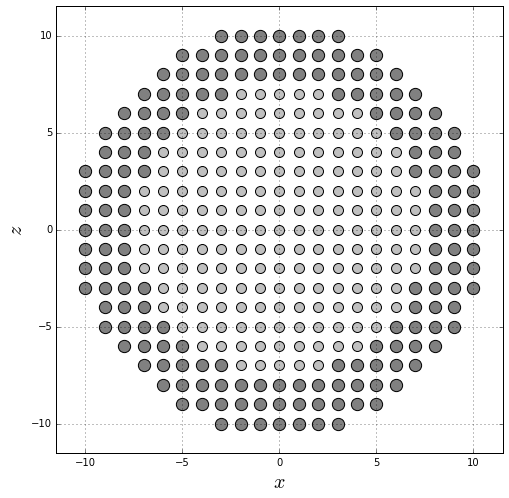
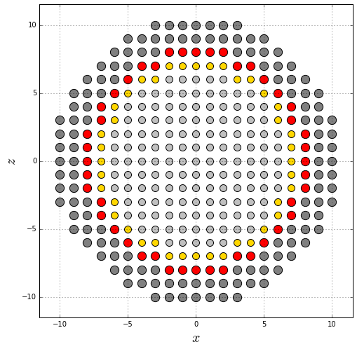
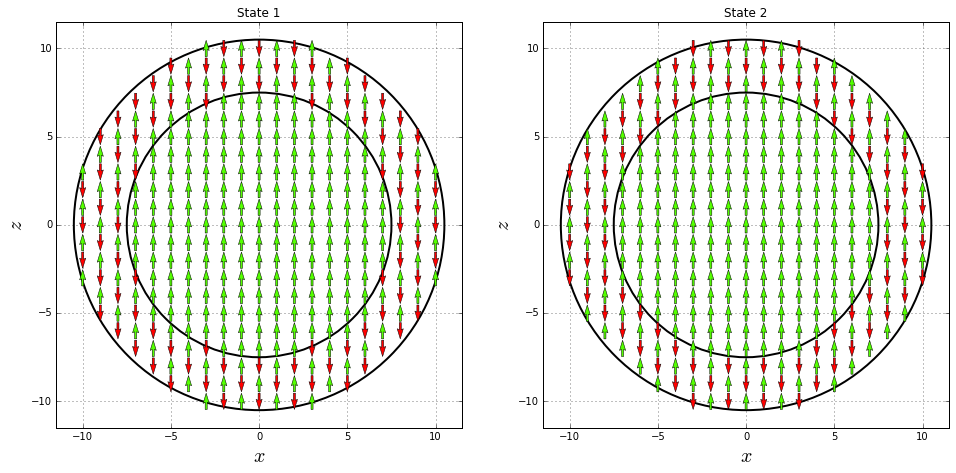

Let's build a core/shell nanoparticle with a simple cubic structure using a python script.

Import the required libraries

* [**numpy**](http://www.numpy.org/) handles numeric arrays and mathematical operations.
* [**product**](https://docs.python.org/3.7/library/itertools.html#itertools.product) returns cartesian product of input iterables.
* [**matplotlib**](https://matplotlib.org/) produces figures.
* [**defaultdict**](https://docs.python.org/3.7/library/collections.html#collections.defaultdict) is a dictionary where each *value* has a defined type.


```python
import numpy
from itertools import product
from matplotlib import pyplot
from collections import defaultdict
```

Define the values of the core (**$R_c$**) and nanoparticle (**$R$**) radius measured in magnetic unit cells. Each site is a magnetic moment.


```python
Rc = 7.5
R = 10.5
```

Define the core $\left(sc\right)$ and shell $\left(ss\right)$ spin values, the core $\left(kc\right)$ and shell $\left(ks\right)$ anisotropy constants, the core-core $\left(jcc\right)$, core/shell $\left(jint\right)$ and shell-shell $\left(jss\right)$ exchange interaction constants, and the [update policy](https://pcm-ca.github.io/vegas/sample-build/update-policies/) for the direction of the magnetic moments.


```python
ss = sc = 1.0
kc = 0.1
ks = 0.5
jcc = 1.0
jint = -0.5
jss = -0.5
update_policy = "adaptive"
```

Create a dictionary to easily retrieve the parameters defined above.


```python
spin = {
    "core": sc,
    "core_interface": sc,
    "shell": ss,
    "shell_interface": ss,
       }

kan = {
    "core": kc,
    "core_interface": kc,
    "shell": ks,
    "shell_interface": ks,
      }

jex = {
    ("core", "core"): jcc,
    ("core", "shell"): jint,
    ("shell", "core"): jint,
    ("shell", "shell"): jss
      }
```

Create a list of sites and assign them as core or shell ions according to $R_c$.


```python
sites = list()
core_sites = list()
shell_sites = list()
for site in product(range(-int(numpy.ceil(R+1)), int(numpy.ceil(R+1))),
                    range(-int(numpy.ceil(R+1)), int(numpy.ceil(R+1))),
                    range(-int(numpy.ceil(R+1)), int(numpy.ceil(R+1)))):
    dist = numpy.linalg.norm(site)
    if dist <= R:
        sites.append(site)
        if dist <= Rc:
            core_sites.append(site)
        else:
            shell_sites.append(site)
```

Convert the previous list to numpy arrays in order to produce a midplane cross-section for $y=0$.


```python
all_positions = numpy.array(sites)
core_positions = numpy.array(core_sites)
shell_positions = numpy.array(shell_sites)
core_positions = core_positions[core_positions[:, 1] == 0]
shell_positions = shell_positions[shell_positions[:, 1] == 0]
```

Generate a graphic of the midplane cross-section using different colors for the core and the shell ions.


```python
pyplot.figure(figsize=(8, 8))
pyplot.scatter(core_positions[:, 0], core_positions[:, 2], s=100, color="silver", edgecolor="black")
pyplot.scatter(shell_positions[:, 0], shell_positions[:, 2], s=150, color="gray", edgecolor="black")
pyplot.grid()
pyplot.xlabel(r"$x$", fontsize=20)
pyplot.ylabel(r"$z$", fontsize=20)
pyplot.xlim(-R-1, R+1)
pyplot.ylim(-R-1, R+1)
pyplot.gca().set_aspect("equal")
pyplot.show()
```





Identify the neighbors of each magnetic moment and store them in a dictionary.


```python
nhbs = defaultdict(list)
for site in sites:
    x, y, z = site
    for dx, dy, dz in [(1, 0, 0), (-1, 0, 0),
                       (0, 1, 0), (0, -1, 0),
                       (0, 0, 1), (0, 0, -1)]:
        nhb = ((x + dx), (y + dy), (z + dz))
        if nhb in sites:
            nhbs[site].append(nhb)
```

Make some verifications: that each site has a maximum of $6$ neighbors, that the neighbors of each site are $1$ $muc$ away, and that each site is in the neighbors list of each of its neighbors.


```python
for site in sites:
    assert len(nhbs[site]) <= 6
    for nhb in nhbs[site]:
        assert numpy.linalg.norm(numpy.array(site) - numpy.array(nhb)) == 1.0
        assert site in nhbs[nhb]
```

Create a dictionary to identify the type of each site, which can be *core*, *shell*, *core\_interface* and *shell\_interface*, which corresponds to sites located in the core, the shell, the core interface and the shell interface, respectively.


```python
types = dict()
for site in sites:
    prefix = "core" if site in core_sites else "shell"
    for nhb in nhbs[site]:
        nhb_prefix = "core" if nhb in core_sites else "shell"
        if prefix != nhb_prefix:
            prefix += "_interface"
            break
    types[site] = prefix
```

Create a dictionary to store all the sites of each type.


```python
positions = defaultdict(list)
for site in sites:
    positions[types[site]].append(site)
```

Verify that there are only four ion types.


```python
positions.keys()
```


    dict_keys(['core_interface', 'core', 'shell', 'shell_interface'])


Again, convert the sites list to numpy arrays in order to produce a midplane cross-section for $z=0$.


```python
core = numpy.array(positions["core"])
shell = numpy.array(positions["shell"])
core_interface = numpy.array(positions["core_interface"])
shell_interface = numpy.array(positions["shell_interface"])
core = core[core[:, 1] == 0]
shell = shell[shell[:, 1] == 0]
core_interface = core_interface[core_interface[:, 1] == 0]
shell_interface = shell_interface[shell_interface[:, 1] == 0]
```

Generate a graphic of the midplane cross-section using different colors for the core, shell, core interface and shell interface ions.


```python
pyplot.figure(figsize=(8, 8))
pyplot.scatter(core[:, 0], core[:, 2], s=100, color="silver", edgecolor="black")
pyplot.scatter(shell[:, 0], shell[:, 2], s=150, color="gray", edgecolor="black")
pyplot.scatter(core_interface[:, 0], core_interface[:, 2], s=100, color="gold", edgecolor="black")
pyplot.scatter(shell_interface[:, 0], shell_interface[:, 2], s=150, color="red", edgecolor="black")
pyplot.grid()
pyplot.xlabel(r"$x$", fontsize=20)
pyplot.ylabel(r"$z$", fontsize=20)
pyplot.xlim(-R-1, R+1)
pyplot.ylim(-R-1, R+1)
pyplot.gca().set_aspect("equal")
pyplot.show()
```





Define the anisotropy and external magnetic field axes for each site, which in this case is the $z$ axis for all the ions.


```python
anisotropy_axis = dict()
field_axis = dict()
for site in sites:
    anisotropy_axis[site] = (0.0, 0.0, 1.0)
    field_axis[site] = (0.0, 0.0, 1.0)
```

Count the number of interactions equal to the sum of the neighbors of each site, and the number of sites as the length of the list of the sites.


```python
num_interactions = 0
for site in sites:
    num_interactions += len(nhbs[site])
num_sites = len(sites)
```

Create the files to store the sample.


```python
sample_file = open("sample.dat", mode="w")
anisotropy_file = open("anisotropy.dat", mode="w")
```

Write in the first line of *sample_file* the number of sites, interactions and types:


```python
sample_file.write("{} {} {}\n".format(num_sites, num_interactions, len(set(types.values()))))
print(num_sites, num_interactions, len(set(types.values())))
```

    4945 27576 4


Write the ion types on a different line each one.


```python
for t in sorted(set(types.values())):
    sample_file.write("{}\n".format(t))
    print(t)
```

    core
    core_interface
    shell
    shell_interface


Write the parameters of each site according to the established [format](https://pcm-ca.github.io/vegas/sample-build/).


```python
for site in sites:
    i = sites.index(site)
    t = types[site]
    sample_file.write("{} {} {} {} {} {} {} {} {} {}\n".format(i, *site, spin[t], *field_axis[site], t, update_policy))
    anisotropy_file.write("{} {} {} {}\n".format(*anisotropy_axis[site], kan[t]))
```

Write the exchange interactions between every pair of neighbors.


```python
for site in sites:
    t = types[site]
    for nhb in nhbs[site]:
        nhb_t = types[nhb]
        sample_file.write("{} {} {}\n".format(
            sites.index(site), sites.index(nhb),
            jex[(t.split("_")[0], nhb_t.split("_")[0])]))
```

Close the files.


```python
sample_file.close()
anisotropy_file.close()
```

## Creando el estado inicial

Supongamos que deseamos crear la muestra como propone wevans. En vista de que este sistema es altamente anisotrópico bla bla, entonces se puede predecir el estado inicial de la muestra bajo la aproximación bla bla bla ... acá citar el paper de wevans.

Definimos una función para calcular la energía del sistema con un campo magnético externo $H_{max}$:


```python
Hmax = 1.0
```


```python
def energy(state, Hmax):
    E_exchange = 0.0
    E_other = 0.0
    for i, site in enumerate(sites):
        t = types[site].split("_")[0]
        for nbh in nhbs[site]:
            t_nbh = types[nbh].split("_")[0]
            E_exchange -= state[i] * state[sites.index(nbh)] * jex[(t, t_nbh)]
        E_other -= (Hmax * state[i] + (kan[t] * state[i])**2)
    return 0.5 * E_exchange + E_other
```

Calculamos uno de los dos posibles estados iniciales tal que sea de la forma $\uparrow \downarrow \uparrow \downarrow$ en el shell y $\uparrow \uparrow \uparrow \uparrow$ para el core:


```python
state1 = list()
for site in sites:
    if types[site].split("_")[0] == "shell":
        if sum(site) % 2 == 0:
            state1.append(-1.0)
        else:
            state1.append(1.0)
    else:
        state1.append(1.0)
        
state1 = numpy.array(state1)
```

Y calculamos el otro de los dos posibles estados iniciales tal que sea de la forma $\downarrow \uparrow \downarrow \uparrow$ en el shell y $\uparrow \uparrow \uparrow \uparrow$ para el core:


```python
state2 = list()
for site in sites:
    if types[site].split("_")[0] == "shell":
        if sum(site) % 2 == 0:
            state2.append(1.0)
        else:
            state2.append(-1.0)
    else:
        state2.append(1.0)

state2 = numpy.array(state2)
```

Con el fin de graficar esa vaina, creamos un core transversal para y = 0 y graficamos el plano xz


```python
directions1 = state1[all_positions[:, 1] == 0]
layer1 = all_positions[all_positions[:, 1] == 0]
x1, y1, z1 = layer1.T

directions2 = state2[all_positions[:, 1] == 0]
layer2 = all_positions[all_positions[:, 1] == 0]
x2, y2, z2 = layer1.T
```

Graficamos los dos posibles estados. Podemos apreciar que todos los sitios del core, en ambos estados, apuntan hacia arriba. Sin embargo, el shell de uo es el inverso del shell del otro, como era de esperarse.


```python
fig = pyplot.figure(figsize=(16, 8))
ax1 = fig.add_subplot(121)
ax2 = fig.add_subplot(122)

ax1.add_artist(pyplot.Circle((0, 0), Rc, color='black', fill=False, lw=2))
ax1.add_artist(pyplot.Circle((0, 0), R, color='black', fill=False, lw=2))
ax1.quiver(x1, z1, 0, directions1, directions1, pivot="middle",
           cmap="prism", scale=25, width=0.005, lw=0.5, zorder=10)
ax1.set_title("State 1")

ax2.add_artist(pyplot.Circle((0, 0), Rc, color='black', fill=False, lw=2))
ax2.add_artist(pyplot.Circle((0, 0), R, color='black', fill=False, lw=2))
ax2.quiver(x2, z2, 0, directions2, directions2, pivot="middle",
           cmap="prism", scale=25, width=0.005, lw=0.5, zorder=10)
ax2.set_title("State 2")

for ax in [ax1, ax2]:
    ax.grid()
    ax.set_xlabel(r"$x$", fontsize=20)
    ax.set_ylabel(r"$z$", fontsize=20)
    ax.set_xlim(-R-1, R+1)
    ax.set_ylim(-R-1, R+1)
    ax.set_aspect("equal")
pyplot.show()
```





Empleando la función ```energy```, podemos calcular la energía de los dos posibles estados iniciales:


```python
print("state1: ", energy(state1, Hmax))
print("state2: ", energy(state2, Hmax))
```

    state1:  -11186.41
    state2:  -11576.41


En este caso, ```state2``` minimiza la energía. Sin embargo, para otros tamaños podría darse que no sea así. Por esta razón, calculamos el estado que minimice la energía:


```python
state = state1 if energy(state1, Hmax) <= energy(state2, Hmax) else state2
```

Por último, debemos almacenar este estado inicial. El formato del archivo para el estado inicial puede consultarse [aquí](www.redtube.com)


```python
initialstate_file = open("initialstate.dat", mode="w")
```


```python
for i, site in enumerate(sites):
    initialstate_file.write("{} {} {}\n".format(0.0, 0.0, state[i]))
```


```python
initialstate_file.close()
```
